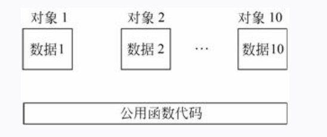
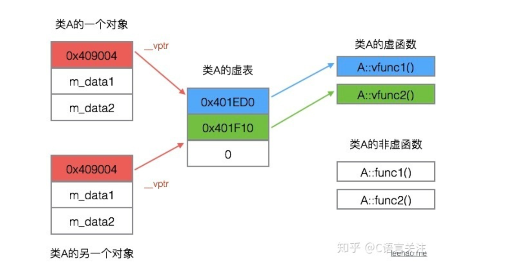

## 类的存储方式
- 在C++中，用类去定义对象时，系统会为每一个对象分配存储空间，如果一个类包括了数据和函数，要分别为数据和函数的代码分配存储空间。
- C++的每个对象所占用的存储空间只是该对象的数据部分所占用的存储空间，而不包括函数代码所占用的存储空间。
一个对象所占的空间大小只取决于该对象中数据成员所占的空间，而与成员函数无关，函数代码是存储在对象空间之外的。 

## 类的成员函数
- 类的成员函数和类外函数的存储方式是相同的，所有同一个类的对象共用一个成员函数，类的成员函数比普通函数多了一个参数是类对象的指针，用来调用成员变量。

## 虚函数表

- 每一个有虚函数的类都会有并且共用一个虚函数表。里面存储了每一个虚函数的指针。
- 每一个有虚函数类对象会有一个指针指向虚函数表，在对象地址的最开始。
- 子类的虚函数会覆盖父类的同名虚函数。实现多态。

